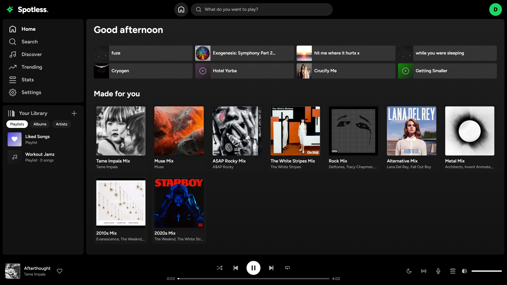
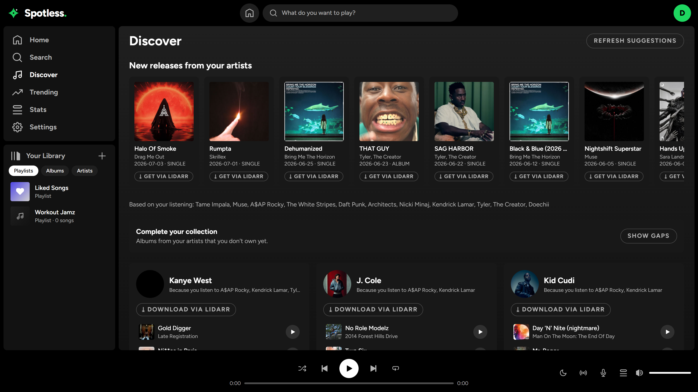
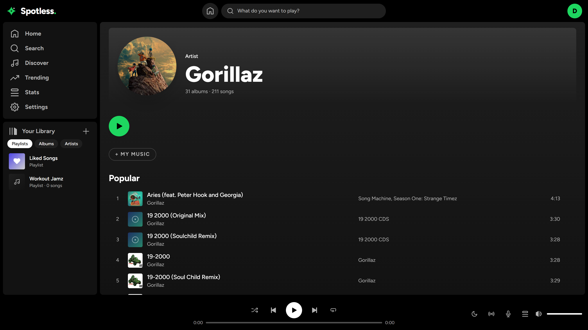
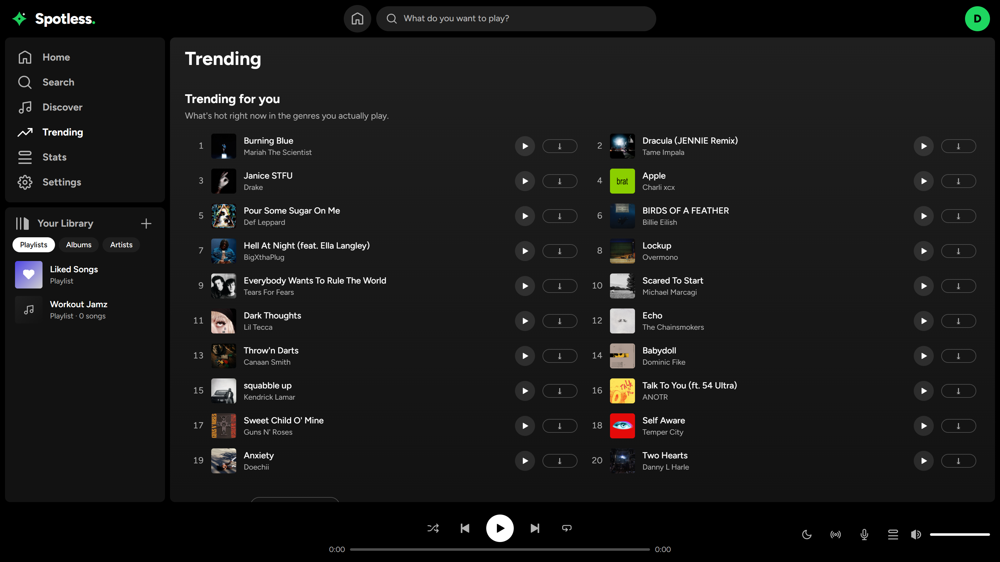
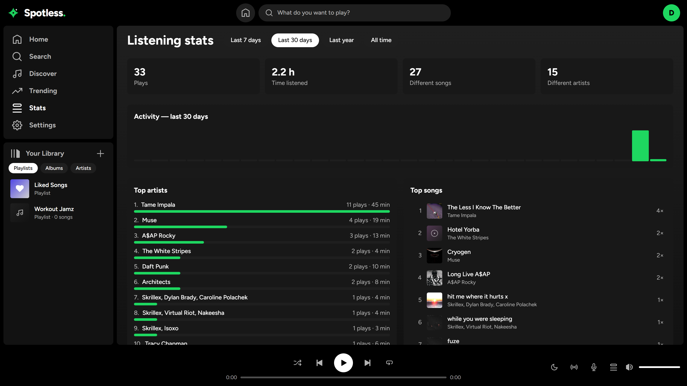
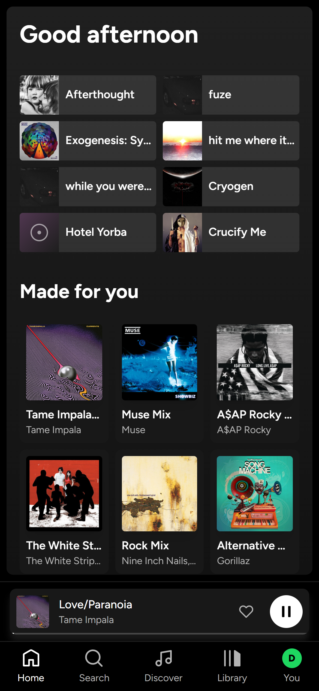
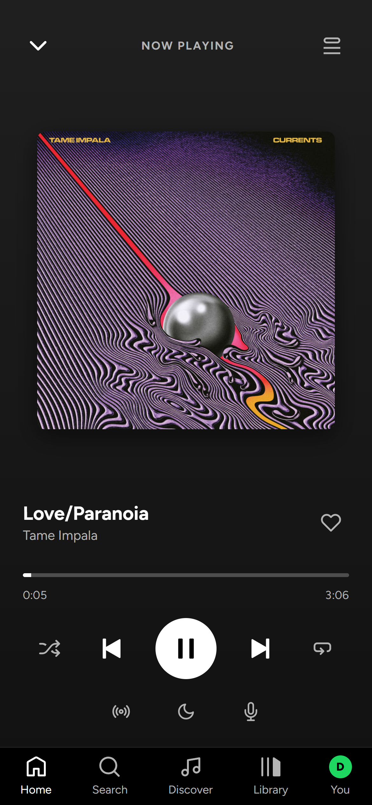
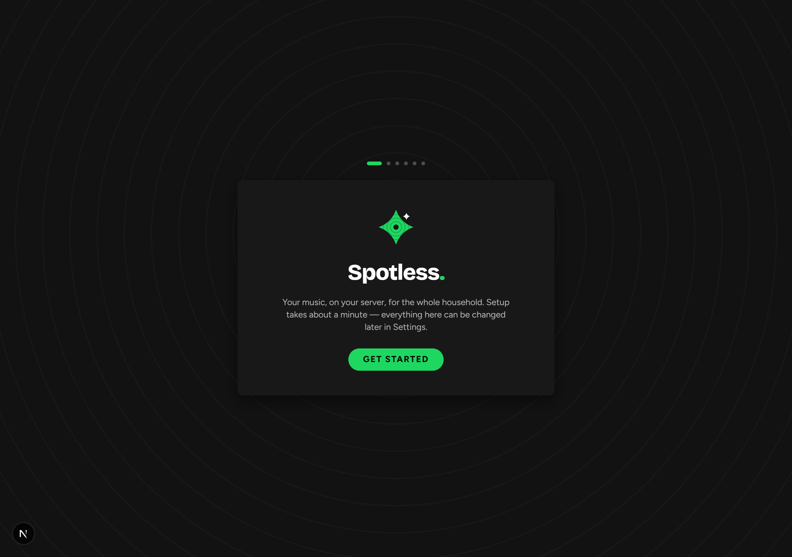

# Spotless

Self-hosted, single-container music streamer for your own files, with a Spotify-style interface. Next.js + SQLite, no external database, no accounts, no cloud.

Point it at a folder of music and it gives your household a fast dark-themed player with profiles, discovery, and optional Lidarr/Spotify integrations.



| Discover — suggestions, new releases, collection gaps | Artist pages |
| --- | --- |
|  |  |

| Trending charts | Listening stats |
| --- | --- |
|  |  |

<p align="center">
  
  &nbsp;
  
</p>

## Features

**Player**
- Gapless playback and configurable crossfade (0–12s), dual-audio-element engine
- Radio mode: any song seeds an endless queue of similar tracks from your own library
- Queue with drag-to-reorder, shuffle, repeat (off/all/one), sleep timer
- ReplayGain volume normalization (read from tags)
- Synced lyrics (lrclib.net) with live highlight
- Media Session API: lock-screen / media-key controls
- Full-screen mobile now-playing, mini-player, responsive layout, installable PWA manifest

**Library**
- Scans MP3, FLAC, M4A, AAC, OGG, OPUS, WAV; extracts tags + embedded album art
- Smart artist matching: feature credits ("A feat. B"), case, diacritics (Tiësto = Tiesto) and
  punctuation variants fold into one artist; self-healing dedupe runs on every scan
- Home feed: recently played, top tracks, artist/genre/decade mixes, forgotten favorites, recently added
- Search: fuzzy local search plus "not in your library" results from Deezer with 30-second previews
- Playlists with drag-reorder and mosaic covers; liked songs; listening stats (tops, activity, periods)
- Duplicate-file report (same song stored twice, e.g. MP3 + FLAC)
- Automatic album/artist artwork backfill via Deezer; nightly database backups

**Multi-user**
- Netflix-style "Who's listening?" profile picker — no passwords, LAN-trust model
- Per-profile likes, history, playlists, stats, discovery taste, and hidden artists
- The first profile is the admin: server settings (music folder, scans, Lidarr) are hidden
  from and blocked (HTTP 403) for everyone else

**Discovery** (no API keys needed — Deezer + Apple RSS public endpoints)
- Per-profile artist suggestions based on listening history, with "not interested" dismissals
- New releases from artists you already have
- "Complete your collection": studio albums you're missing, repackage/remix noise filtered out
- Trending: country charts with region picker, genre rows, "trending for you" genre blend

**Integrations** (optional)
- **Lidarr**: one-click add + search for a whole artist or one specific album; live download
  queue widget; webhook triggers a library rescan when imports finish.
  Non-admin profiles don't download directly — they file requests, and the admin
  approves or denies them from a queue on the Discover page.
- **Spotify**: per-profile PKCE connect imports your taste (top + saved artists) to seed
  discovery, and can rebuild your Spotify playlists from matching local files. Requires
  creating a (free) Spotify app and setting `SPOTIFY_CLIENT_ID`.

## Quick start (Docker)

1. Edit `docker-compose.yml` — point the music volume at your library:

   ```yaml
   volumes:
     - /path/to/your/music:/music:ro
     - ./data:/data
   ```

2. Build and run:

   ```bash
   docker compose up -d --build
   ```

3. Open `http://<server-ip>:3000` — a setup wizard walks you through creating your profile
   (the first one becomes the admin), scanning your library, and the optional Lidarr and
   Spotify hookups. Every step is skippable and lives in Settings afterwards.

   

## Configuration

| Env var             | Default  | Purpose                                              |
| ------------------- | -------- | ---------------------------------------------------- |
| `MUSIC_DIR`         | `/music` | Folder scanned for audio files                       |
| `DATA_DIR`          | `/data`  | SQLite DB, extracted album art, nightly backups      |
| `PORT`              | `3000`   | HTTP port                                            |
| `SPOTIFY_CLIENT_ID` | _(none)_ | Optional; enables the Spotify taste/playlist import  |

Lidarr is configured in the app (Settings → Lidarr: URL + API key). To get automatic
rescans after Lidarr imports, add a webhook in Lidarr → Settings → Connect →
Webhook pointing at `http://<spotless-host>:3000/api/lidarr/webhook`.

### Spotify setup (optional)

1. Create an app at <https://developer.spotify.com/dashboard>
2. Add `http://127.0.0.1:3000/api/spotify/callback` as a redirect URI
3. Set `SPOTIFY_CLIENT_ID` to the app's client ID (no secret needed — PKCE flow)
4. The connect flow must be opened from the machine running Spotless via
   `http://127.0.0.1:3000` (a Spotify platform restriction on loopback redirect URIs),
   and each profile that connects must be added under User Management in your
   Spotify app dashboard while the app is in development mode.

## Local development

```bash
npm install
# put some audio files in ./music (or set MUSIC_DIR)
npm run dev
```

## Security model — read this

**There is no authentication.** Profiles are passwordless and switchable by anyone who can
reach the page; the admin gate protects against accidents, not attackers. Run it on a
trusted home LAN only. If you want remote access, put it behind your own auth layer
(Tailscale/WireGuard, or a reverse proxy with authentication) — do not port-forward it
to the internet as-is.

Other notes:

- Your music folder is mounted read-only and never modified; all app state lives in `DATA_DIR`
- Nightly DB backups are kept in `DATA_DIR/backups` (last 7)
- FLAC/OGG/OPUS playback depends on browser codec support (fine in Chromium/Firefox; Safari lacks OGG/OPUS)

## License

MIT — see [LICENSE](LICENSE).
