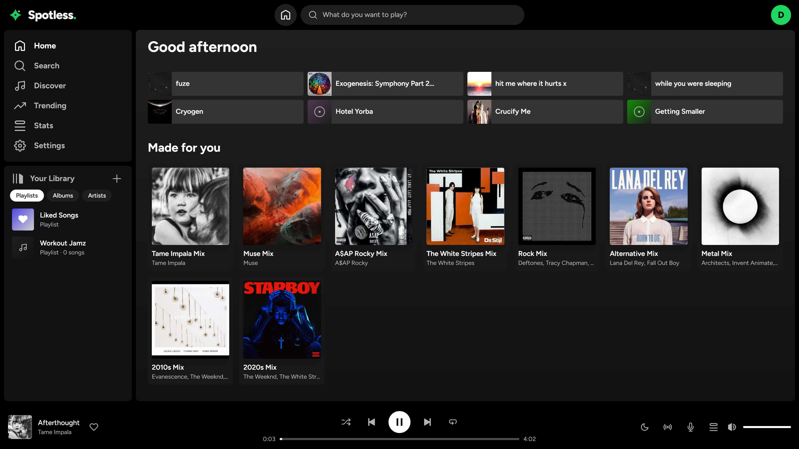
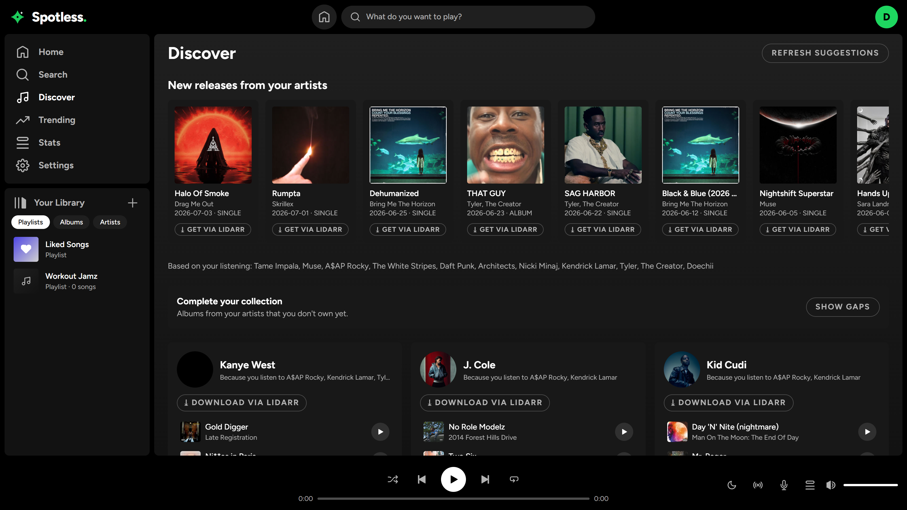
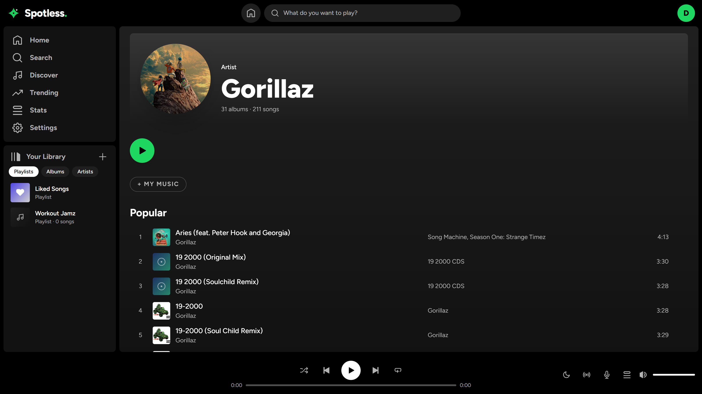
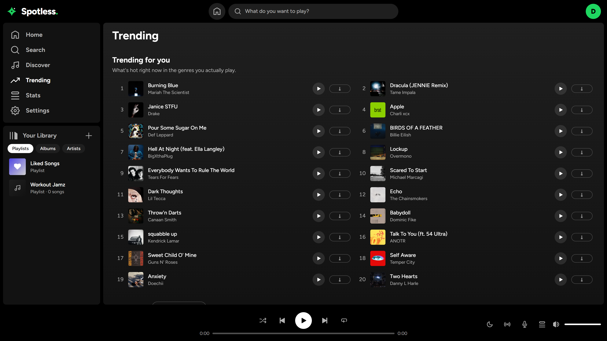
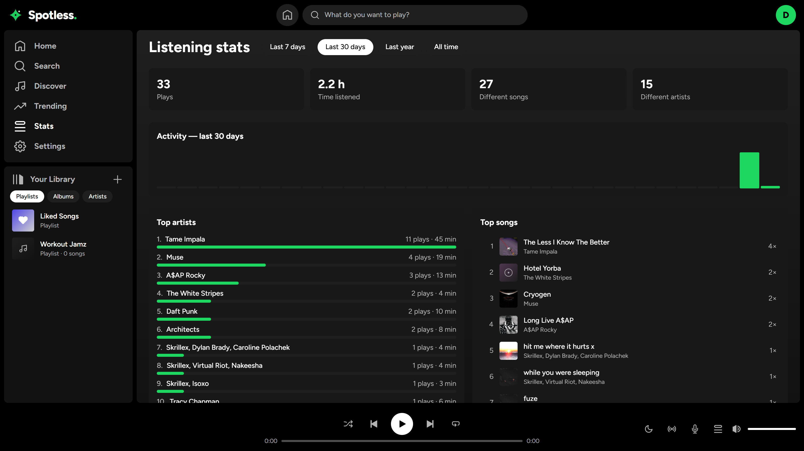
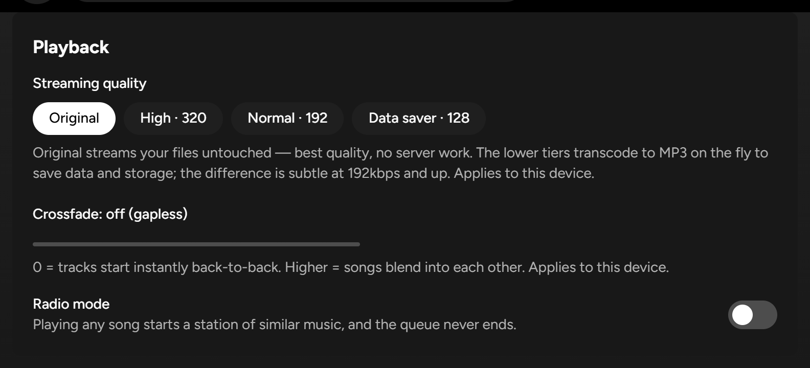
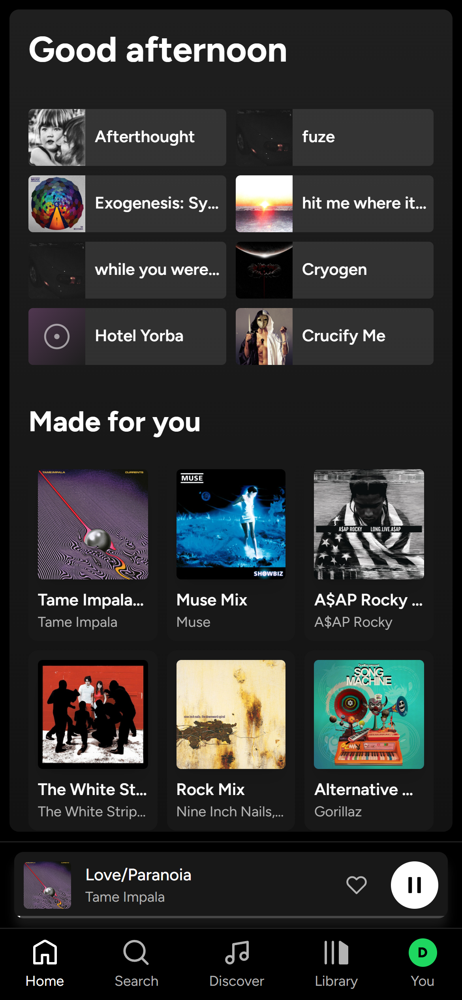
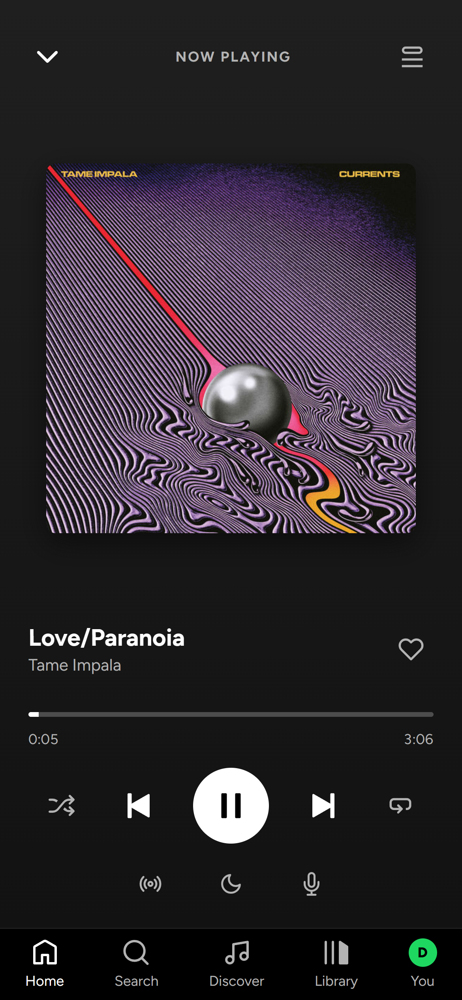
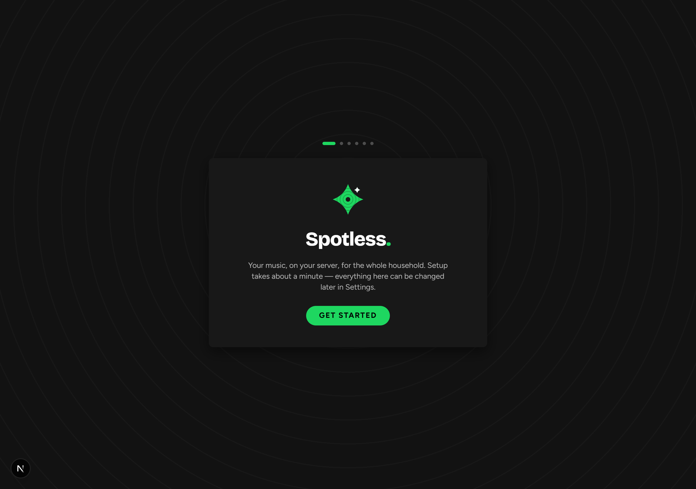

# Spotless

Self-hosted, single-container music streamer with a Spotify-style interface.

Point it at a folder of music and it gives you a dark-themed player with profiles, discovery, a 10-band EQ,
internet radio, an optional AI DJ, and Lidarr, Spotify and Last.fm integrations. Everything runs from one Docker
image with an SQLite database; your audio files stay where they are and are only ever read.

Acknowledgements: Spotless builds on the original Spotless project by lateshift.tech (see [LICENSE](LICENSE));
thanks to its authors and contributors for the foundation this version grows from.



| Discover — suggestions, new releases, collection gaps | Artist pages |
| --- | --- |
|  |  |

| Trending charts | Listening stats |
| --- | --- |
|  |  |

Per-device streaming quality — original files, a fixed MP3 tier, or **Auto**, which follows your
connection and steps down when the network can't keep up:



<p align="center">
  
  &nbsp;
  
</p>

## Features

**Player**

- Gapless playback and configurable crossfade (0–12s), dual-audio-element engine
- Adaptive streaming quality (Auto): full quality on Wi-Fi, a lighter stream on mobile data, and a step down
  the moment playback starts to stutter — the song resumes from where it was, not from the top. Recovers a
  stream that dies mid-song instead of leaving it stalled
- Radio mode: any song seeds an endless queue of similar tracks from your own library
- Queue with drag-to-reorder, shuffle, repeat (off/all/one), sleep timer; the queue survives a page reload
- Keyboard shortcuts: <kbd>Space</kbd> play/pause, <kbd>←</kbd>/<kbd>→</kbd> seek 5s,
  <kbd>Shift</kbd>+<kbd>←</kbd>/<kbd>→</kbd> previous/next, <kbd>M</kbd> mute, <kbd>/</kbd> search
- ReplayGain volume normalization (read from tags)
- 10-band graphic equalizer (31 Hz – 16 kHz, ±12 dB) with 13 presets or your own curve; per device, and
  switching it off is an exact bypass
- Internet radio: add any Icecast/Shoutcast stream by URL under **Radio** in the sidebar and it plays through
  the same player (stations are exposed to Subsonic apps too)
- Synced lyrics, with local sidecar `.lrc` files taking priority over the cache and LRCLIB
- Media Session API: lock-screen / media-key controls
- Full-screen mobile now-playing, mini-player, responsive layout, installable PWA manifest

**Library**

- Scans MP3, FLAC, M4A, AAC, OGG, OPUS, WAV; extracts tags + embedded album art; multi-disc albums are
  ordered by disc, then track
- Smart artist matching: feature credits ("A feat. B"), case, diacritics (Tiësto = Tiesto) and punctuation
  variants fold into one artist; self-healing dedupe runs on every scan
- Renamed or moved files keep their likes, history and playlist entries
- Home feed: recently played, top tracks, artist/genre/decade mixes, forgotten favorites, recently added
- Search: fuzzy local search plus "not in your library" results from Deezer with 30-second previews
- Playlists with drag-reorder and mosaic covers; liked songs; listening stats (tops, activity, periods)
- Duplicate-file report (same song stored twice, e.g. MP3 + FLAC)
- Album/artist artwork repair: local `cover`/`folder`/`front` images first, then conservative exact-match
  Deezer backfill
- Optional automatic library refresh (**Settings → Music library**): off by default, or every 5 / 15 / 30
  minutes, 1 / 3 / 6 / 12 / 24 hours. Scans never overlap, unchanged files are skipped by modification
  time, and a manual rescan resets the timer
- Optional automatic synced `.lrc` download (**Settings → Music library**): after each scan, tracks without
  a sidecar get synchronized lyrics from LRCLIB saved beside the audio file. Existing `.lrc`/`.LRC` files
  are never overwritten
- Nightly, integrity-checked database backups

**Multi-user**

- Netflix-style "Who's listening?" profile picker; each profile signs in with its own password
- Per-profile likes, history, playlists, stats, discovery taste, and hidden artists; playlists can only be
  changed by the profile that owns them
- The first profile is the admin: server settings (music folder, scans, Lidarr) are hidden from and blocked
  (HTTP 403) for everyone else
- **Manage profiles** (`/users`, admin only): create profiles, set/reset passwords, revoke sessions
- See [Web authentication](#web-authentication-and-profile-management) for how sessions and passwords work

**AI DJ** (local by default; nothing leaves your server unless you pick a hosted provider)

- Chat with a music-nerd DJ that knows each profile's library, play history, likes, Spotify taste and
  Discover picks
- "Start my DJ" builds a set from your library and plays it; ask for a mood, an artist, a genre, or a
  playlist and it does it
- Creates playlists for you; songs you don't own are kept as placeholders that fill in after a future scan
- Suggests songs you don't have yet, with Deezer previews and a one-click Lidarr add
- Talks: speaks its replies and introduces songs between tracks (music ducks while it talks), like a radio host
- Push-to-talk voice input through a local Whisper server
- Brains: LM Studio (default) or Ollama, both local, any OpenAI-compatible server, or OpenAI, Anthropic,
  Gemini, Mistral, DeepSeek, xAI, Groq, OpenRouter
- Voice: a local speech server such as Kokoro-FastAPI (default), on-device browser voices, or OpenAI / ElevenLabs

**Discovery** (no API keys needed — Deezer + Apple RSS public endpoints)

- Per-profile artist suggestions based on listening history, with "not interested" dismissals
- New releases from artists you already have
- "Complete your collection": studio albums you're missing, repackage/remix noise filtered out
- Trending: country charts with region picker, genre rows, "trending for you" genre blend

**Mobile apps (Subsonic / OpenSubsonic API)**

- Native apps work out of the box — **Amperfy (iOS)**, **Symfonium**, **DSub**, **Substreamer**,
  **play:Sub** and friends — with the offline download/sync those apps provide
- Synced lyrics via OpenSubsonic `getLyricsBySongId` (`songLyrics` v1) and plain lyrics via legacy `getLyrics`
- On-the-fly **transcoding** via ffmpeg (mp3/ogg/opus/aac, client-requested bitrate) for streaming big FLAC
  libraries over mobile data; files that already fit the requested quality are served as-is
- Each profile gets its own generated app password (Settings → Mobile apps); stars, scrobbles, playlists
  and recently-played land on the right profile

**Integrations** (optional)

- **Lidarr**: one-click add + search for a whole artist or one specific album; live download queue widget;
  webhook triggers a library rescan when imports finish. Non-admin profiles file requests instead, which
  the admin approves or denies from a queue on the Discover page
- **Spotify**: per-profile PKCE connect imports your taste (top + saved artists) to seed discovery, and can
  rebuild your Spotify playlists from matching local files. Needs a free Spotify app (see
  [Spotify setup](#spotify-setup-optional))
- **Last.fm**: the admin enters an API key once, then each profile connects its own account. Plays from the
  web player and Subsonic apps are scrobbled (with now-playing updates) to whoever is listening

## Quick start (Docker)

1. Edit `docker-compose.yml` and point both music volumes at your library:

   ```yaml
   volumes:
     # scanning and streaming are read-only
     - /path/to/your/music:/music:ro
     # same folder again, used only to write generated .lrc lyrics (optional)
     - /path/to/your/music:/music-write:rw
     - ./data:/data
   ```

   Other settings go in the `environment:` block or in a `.env` file next to the compose file (copy
   `.env.example`); see [Configuration](#configuration).

2. Start it. The compose file references the prebuilt multi-arch image (amd64 + arm64) on GHCR:

   ```bash
   docker compose pull && docker compose up -d
   ```

   Or build from source with `docker compose up -d --build`.

3. Open `http://<server-ip>:3000`. A setup wizard walks you through creating the first profile (which
   becomes the admin) and its web password, scanning your library, and the optional Lidarr and Spotify
   hookups. Every step except the admin password can be skipped.

   

**Data folder ownership.** On first start the container runs as root just long enough to make the
bind-mounted `./data` folder writable (Docker creates it root-owned), then drops to an unprivileged user. Set
`PUID` / `PGID` to the uid/gid that should own `./data` (defaults `1000` / `1000`; `id -u` and `id -g` print
yours). Only `/data` (and `BACKUP_DIR`, when it points at a separate mount) is ever chowned; your music mount is never touched.

**Health check.** The image includes a `HEALTHCHECK` against `GET /api/health`, which returns
`200 { "ok": true }` while the database is reachable and `503` otherwise.

**Optional local voice for the AI DJ.** `docker-compose.voice.yml` runs Kokoro (speech) and Speaches
(Whisper) next to Spotless; the comments at the top of that file list the values to enter in
Settings → AI DJ:

```bash
docker compose -f docker-compose.yml -f docker-compose.voice.yml up -d
```

## Versions and updates

The running version is shown in Settings → About (with the build commit), returned by `/api/health`, and
reported to Subsonic apps as `serverVersion`. Each release is a git tag `vX.Y.Z` with notes on the
[releases page](https://github.com/Dj2Swagittarius/spotless/releases) and in [CHANGELOG.md](CHANGELOG.md).

| Image tag | Follows |
| --- | --- |
| `:latest` | every push to `main` |
| `:0.2` | patch releases of 0.2 |
| `:0.2.0` | that exact release |

To stay on a release line, change the `image:` line in `docker-compose.yml`. Update with
`docker compose pull && docker compose up -d`. Read the changelog before moving to a new minor version:
entries marked **Breaking** may need a config change.

## Desktop app

Prefer a window of its own over a browser tab? Each [release](https://github.com/Dj2Swagittarius/spotless/releases)
has installers for a small desktop app that connects to your Spotless server:

| System | File |
| --- | --- |
| Windows 10/11 | `Spotless-Setup-X.Y.Z.exe` |
| macOS (Intel and Apple Silicon) | `Spotless-X.Y.Z-mac-universal.dmg` |
| Linux | `Spotless-X.Y.Z-linux-x86_64.AppImage` or `.deb` |

On first launch, enter the address you use in the browser (for example `http://192.168.1.10:3000`) or press
**Scan network**, which looks for Spotless on this computer and your local network (ports 3000, 4000, 8080 and 80).
The app remembers the server; **Alt** shows the menu on Windows/Linux, where **Spotless → Change server…** switches
to another one. It is the same web player, so every feature and theme works, plus media keys and the system media
controls.

The installers are not code-signed yet. Windows SmartScreen asks once (**More info → Run anyway**); on macOS open the
app, then allow it under **System Settings → Privacy & Security → Open Anyway**.

To run or build it from source: `cd desktop && npm ci && npm start` (or `npx electron-builder` for an installer for
the current system, written to `desktop/dist/`).

## Configuration

| Env var | Default | Purpose |
| --- | --- | --- |
| `MUSIC_DIR` | `/music` | Read path scanned/streamed by Spotless |
| `MUSIC_WRITE_DIR` | same as `MUSIC_DIR` outside Docker; `/music-write` in supplied Dockerfile | Optional write mirror used only to create generated `.lrc` sidecars |
| `DATA_DIR` | `/data` | SQLite DB, extracted album art, nightly backups |
| `PORT` | `3000` | HTTP port |
| `SPOTIFY_CLIENT_ID` | *(none)* | Optional; enables the Spotify taste/playlist import |
| `SPOTIFY_REDIRECT_URI` | `http://127.0.0.1:3000/api/spotify/callback` | Optional deployment default for Spotify OAuth; Settings → Spotify overrides it |
| `FFMPEG_PATH` | `ffmpeg` | Path to ffmpeg (bundled in the Docker image) |
| `GIT_SHA` | *(set by CI)* | Build time only: commit shown in Settings → About and `/api/health`. Docker builds pass it as a build arg; a local `npm run build` reads it from git |
| `TRANSCODE_MAX_ACTIVE` | number of CPU cores | Maximum concurrent ffmpeg transcodes; once reached, extra listeners get the raw file instead of a transcode (or `503` when they asked to start mid-track) |
| `ALLOW_PRIVATE_STREAM_URLS` | *(off)* | Set to `1` to let internet radio stations point at loopback, LAN (RFC 1918) or link-local IP addresses, e.g. an Icecast box on `192.168.x.x`. Off by default so the station proxy cannot be used to read other services on your network; stations addressed by hostname are unaffected |
| `LIDARR_WEBHOOK_SECRET` | *(none)* | Optional; if set, the Lidarr webhook requires the secret in an `X-Webhook-Token` header (or, less safely, as `?token=<secret>` in the URL) |
| `AUTH_SECURE_COOKIE` | *(auto)* | Force the web session cookie to `Secure`; use `true` behind HTTPS if proxy detection is unavailable |
| `OLLAMA_URL` / `LMSTUDIO_URL` | `http://localhost:11434` / `http://localhost:1234/v1` | AI DJ: default local LLM server URLs |
| `TTS_URL` / `STT_URL` | `http://localhost:8880/v1` / `http://localhost:8000/v1` | AI DJ: default local voice and speech recognition servers |
| `DJ_MODEL` | *(none)* | AI DJ: default model id |
| `OPENAI_API_KEY`, `ANTHROPIC_API_KEY`, `GEMINI_API_KEY`, `MISTRAL_API_KEY`, `DEEPSEEK_API_KEY`, `XAI_API_KEY`, `GROQ_API_KEY`, `OPENROUTER_API_KEY`, `ELEVENLABS_API_KEY` | *(none)* | AI DJ: optional keys for hosted providers (keys saved in Settings take priority) |
| `AUTH_MIN_PASSWORD_LENGTH` | `4` | Minimum web password length. `4` allows a PIN on a home network; raise it (e.g. `12`) if Spotless is reachable from the internet |
| `TRUST_PROXY` | *(off)* | Number of reverse-proxy hops in front of Spotless (usually `1`). Lets login throttling read the client IP from `X-Forwarded-For`, and lets the Spotify / Last.fm OAuth callback URLs be built from `X-Forwarded-Host` / `X-Forwarded-Proto` (set it when your proxy rewrites the `Host` header, e.g. nginx `proxy_set_header Host $proxy_host`). Leave unset when clients connect directly, because the headers can be forged |
| `DJ_PROVIDER` | `lmstudio` | AI DJ: default LLM provider id (`lmstudio`, `ollama`, `custom`, `openai`, `anthropic`, `gemini`, `mistral`, `deepseek`, `xai`, `groq` or `openrouter`; unknown values fall back to `lmstudio`). Settings → AI DJ overrides it |
| `DJ_RATE_LIMIT_PER_MIN` | `20` chat / `60` speak / `30` segue / `30` transcribe | AI DJ: requests per minute per profile and route; one number overrides all four, `0` disables the limit |
| `BACKUP_DIR` | `DATA_DIR/backups` | Where the daily database backups are written. In Docker it may be its own mount (e.g. `./backups:/backups`); the entrypoint makes it writable by `PUID`/`PGID` the same way as `/data` |
| `LOG_LEVEL` | `info` | Server log verbosity: `debug`, `info`, `warn` or `error` |
| `HOSTNAME` | `0.0.0.0` | Bind address of the production server |
| `PUID` / `PGID` | `1000` / `1000` | Docker only: uid/gid that owns `/data` (and a separate `BACKUP_DIR`) and runs the app (see *Data folder ownership* above) |

Automatic library refresh is configured inside **Settings → Music library** and is stored
in `DATA_DIR/library.db`; no environment variable is required. The default is **Off**.
Spotless still performs its existing startup scan and manual/Lidarr-triggered scans when
automatic refresh is disabled. Recurring intervals are measured from the completion of the
latest scan, so scans do not overlap.

Automatic synchronized sidecar download is also configured in **Settings → Music library** and
is **Off by default**. When enabled, every successful startup/manual/automatic/Lidarr-triggered
scan starts a background check for missing lyrics. Spotless talks directly to the LRCLIB API,
requests only synchronized lyrics, throttles batch requests, honors rate-limit responses, and
never overwrites an existing `.lrc` or `.LRC` file. LRCLIB misses/plain-only results are retried
later rather than queried on every short scan interval.

The supplied Docker configuration keeps the normal application library at `/music:ro` and mounts
the same host folder a second time at `/music-write:rw`. Only the sidecar downloader maps track
paths to that write mount. If your host permissions do not allow the container user to create
files there, the Settings page will report a lyrics write error and your music files remain untouched.

Lidarr is configured in the app (Settings → Lidarr: URL + API key). To get automatic
rescans after Lidarr imports, add a webhook in Lidarr → Settings → Connect →
Webhook pointing at `http://<spotless-host>:3000/api/lidarr/webhook`. If you set
`LIDARR_WEBHOOK_SECRET`, add a request header `X-Webhook-Token: <secret>` in Lidarr's webhook
settings (newer Lidarr versions have a Headers field); appending `?token=<secret>` to the URL
also works but leaves the secret in proxy and access logs. Without a secret the webhook is
unauthenticated. Keep that endpoint restricted to a trusted network or set a webhook secret.

### Web authentication and profile management

Each profile signs in to the web UI with its own password.

- The browser receives only an opaque random session cookie, `spotless_session`: `HttpOnly`,
  `SameSite=Lax`, and `Secure` when Spotless detects HTTPS. Sessions are validated server-side against SQLite.
- Web passwords are hashed with Node's memory-hard `scrypt`; plaintext passwords are never stored.
- Failed logins are progressively rate-limited: per profile, or per profile and client IP when
  `TRUST_PROXY` is set. Password checks run off the main thread, at most two at a time, and excess attempts
  get HTTP 429, so a login flood can't stall playback.
- Mutating `/api/*` requests are protected by same-origin checks on top of the SameSite cookie policy.
- Password changes and resets revoke that profile's existing web sessions.
- The Lidarr webhook and Subsonic `/rest/*` authentication are separate from browser sessions.

#### Creating and managing users

The first profile is the administrator. Open the profile menu and choose **Manage profiles** (or go to
`/users`) to:

- create new profiles and assign their initial passwords
- set or reset passwords for existing profiles (which also signs that profile out everywhere)

Non-admin profiles can change only their own password, and must enter their current one.

#### Upgrading an existing passwordless installation

Back up the database first:

```bash
cp ./data/library.db ./data/library.db.pre-auth-backup
```

After starting the new version:

1. Open Spotless and select profile 1 (the existing admin).
2. If no web password has ever been configured, Spotless offers a one-time **Create admin password** flow.
   Set a password or PIN (at least `AUTH_MIN_PASSWORD_LENGTH` characters, default 4).
3. Sign in, open **Manage profiles**, and assign passwords to the other profiles. They stay locked until you do.

The one-time claim is available only while no web password exists anywhere in the database, and closes as
soon as the first one is set. Do this while the server is still restricted to a trusted network: whoever
opens the picker first can claim the admin profile.

#### HTTPS and secure cookies

Authentication does **not** replace transport encryption. For remote access, use HTTPS through a reverse
proxy or a private network/VPN such as Tailscale or WireGuard; never expose plain HTTP to the internet.

Behind an HTTPS reverse proxy, forward the original host and protocol (`X-Forwarded-Proto: https`) and
Spotless switches to a `Secure` cookie automatically. If your proxy setup prevents detection, force it with
`AUTH_SECURE_COOKIE=true` — but not when you reach Spotless over plain HTTP, because browsers won't send a
`Secure` cookie there.

### Connecting a mobile app

Open **Settings → Mobile apps** on the profile you want to use. It shows the server URL, username and a
generated app password; add those as a Subsonic server in Amperfy, Symfonium, DSub, Substreamer, play:Sub
or any other compatible client. Downloads/offline mode and bitrate choices are handled by the app.

Lyrics are served through legacy Subsonic `getLyrics` (plain text) and OpenSubsonic `getLyricsBySongId`
(`songLyrics` v1, synchronized). For synced lyrics Spotless first looks for a same-basename `.lrc` beside
the audio file, then its cache, then LRCLIB:

```text
/music/Artist/Album/Song.flac
/music/Artist/Album/Song.lrc
```

With **Automatic synced lyrics sidecars** enabled, missing synchronized LRCLIB results are also saved as
`.lrc` files after each library scan (plain-only results are not written).

### Spotify setup (optional)

1. Create an app at <https://developer.spotify.com/dashboard>.
2. Set `SPOTIFY_CLIENT_ID` to the app's client ID (no secret needed — Spotless uses PKCE).
3. Choose the callback URI. In order of precedence:
   - a public domain entered in **Settings → Spotify** (admin), e.g. `music.example.com`, which becomes
     `https://music.example.com/api/spotify/callback`
   - the `SPOTIFY_REDIRECT_URI` environment variable, set to the full callback URI
   - the loopback default, `http://127.0.0.1:3000/api/spotify/callback`
4. Add the **exact** callback URI shown in Settings to your Spotify app's Redirect URIs. Spotify requires
   HTTPS for anything except loopback IP literals such as `127.0.0.1`.
5. Click **Connect Spotify**. If a public domain is configured and you opened Spotless via a LAN address,
   you're sent to the public origin with a single-use, two-minute link carrying your signed-in profile. The
   OAuth state and target profile stay server-side, so the browser can't choose which profile the Spotify
   account attaches to.
6. While the Spotify app is in development mode, add each Spotify account that will connect under User
   Management in the Spotify developer dashboard.

### Last.fm setup (optional)

1. Create a free API account at <https://www.last.fm/api/account/create> (any name; the callback URL can
   stay blank).
2. As the admin, paste the API key and shared secret into **Settings → Last.fm** and hit **Test & save**.
3. Each profile then clicks **Connect Last.fm** on the same page to link its own account.

### AI DJ

Open **Settings → AI DJ** as the admin profile. Everything defaults to servers on your own machine:

1. **Brain:** in [LM Studio](https://lmstudio.ai) (the default) download a model such as `openai/gpt-oss-20b`, open the Developer tab and start the server (enable "Serve on Local Network" when Spotless runs in Docker or on another machine). [Ollama](https://ollama.com) (`ollama pull gpt-oss:20b`) works too. Pick the provider, hit **Load models**, choose one and **Test model**. gpt-oss reasons before answering, so it picks better sets but is slower; Qwen 3 or Gemma 3 answer faster on smaller GPUs. For Ollama, the context size field is sent as `num_ctx` (16k default) so the library summary fits.

2. **Voice:** run a local OpenAI-compatible speech server, for example [Kokoro-FastAPI](https://github.com/remsky/Kokoro-FastAPI): `docker run -p 8880:8880 ghcr.io/remsky/kokoro-fastapi-cpu:latest` (GPU images exist). Model `kokoro`, voice e.g. `am_michael`. **Browser voice** uses only on-device voices; **Off** keeps the DJ text-only.

3. **Listening:** push-to-talk needs a local Whisper server with an OpenAI-style `/v1/audio/transcriptions` endpoint, such as [Speaches](https://github.com/speaches-ai/speaches) (`Systran/faster-whisper-small`). Some servers need the model downloaded first; see their docs. Browsers only allow the mic over HTTPS or on localhost. The browser's built-in speech recognition is not used because Chrome sends that audio to Google.

   Or run both with `docker-compose.voice.yml` (see [Quick start](#quick-start-docker)).

4. Hosted providers (OpenAI, Anthropic, Gemini, Mistral, DeepSeek, xAI, Groq, OpenRouter, ElevenLabs) are optional. The settings page warns when a choice sends data off your server. API keys are stored in the database and never sent back to the browser.

When Spotless runs in Docker, `localhost` is the container itself: use `http://host.docker.internal:PORT` (the supplied `docker-compose.yml` maps it to the host).

The DJ only plays songs it can match to your library. Picks it can't match are shown as suggestions after a Deezer lookup: a song Deezer does not know under that artist is dropped as made up, and the DJ is asked once for replacements. If Deezer cannot be reached, songs the DJ explicitly suggested are still shown (unverified, without a preview) while unmatched play picks are not. Each profile's chat history is kept in that browser only.

## Backup and restore

Spotless copies the SQLite database to `DATA_DIR/backups/library-YYYY-MM-DD.db` (or `BACKUP_DIR` if set) on
startup and once every 24 hours, keeping the last 7. Each copy is written to a temporary file, integrity-checked
with `PRAGMA quick_check`, and only then renamed into place, so a half-written backup never replaces a good one.
With the default compose file that is `./data/backups` on the host. To keep backups on another disk, mount it and
point `BACKUP_DIR` at it (for example `- ./backups:/backups` under `volumes:` and `BACKUP_DIR=/backups` under
`environment:`); the entrypoint makes that mount writable by `PUID`/`PGID` just like `/data`.

To restore:

1. Stop the container: `docker compose down`.
2. Copy the backup over the live database: `cp data/backups/library-YYYY-MM-DD.db data/library.db`.
3. Delete the stale journal files if they exist: `rm -f data/library.db-wal data/library.db-shm`.
4. Start again: `docker compose up -d`.

Extracted album art lives in `DATA_DIR/art` and is rebuilt by the next library scan if it is missing.

## Development

See [CONTRIBUTING.md](CONTRIBUTING.md) for the full setup, the throwaway Docker test stack on port 3300, and
what a pull request needs. The short version:

```bash
npm ci
# put some audio files in ./music (or set MUSIC_DIR)
npm run dev
```

| Script | Purpose |
| --- | --- |
| `npm run typecheck` | TypeScript, no emit |
| `npm run lint` | ESLint (`eslint-config-next`) |
| `npm test` | Vitest unit tests |
| `npm run format:check` | Prettier |
| `npm run build` | Production build |

CI runs typecheck, lint, the unit tests and the production build on every pull request; `format:check` is not
enforced yet because a repo-wide format has never been run (see CONTRIBUTING.md). `GET /api/health` is handy
while developing: it answers `200` once the server and database are up.

**Releasing.** Add notes under `## [Unreleased]` in [CHANGELOG.md](CHANGELOG.md) as you go, then:

```bash
npm run release -- patch
```

That bumps `package.json`, dates the changelog section, commits `Release vX.Y.Z` and tags it (`--dry-run`
previews). Push with `git push origin main --follow-tags`; CI publishes the `:X.Y.Z` / `:X.Y` image tags,
builds the desktop installers and creates the GitHub Release from the changelog section with the installers attached.

## Security model — read this

Spotless has web authentication (see [above](#web-authentication-and-profile-management)), but secure
deployment still matters.

**Network**

- Authentication does not make plain HTTP safe on an untrusted network. For remote access use HTTPS through
  a reverse proxy, or a private network/VPN such as Tailscale or WireGuard. Internet-facing: authentication +
  HTTPS is the minimum; a VPN layer is a useful extra boundary.
- `/api/lidarr/webhook` is callable without a browser session. If it's reachable outside a trusted network,
  set `LIDARR_WEBHOOK_SECRET`.
- Internet radio stations on loopback/LAN/link-local IP addresses are refused unless
  `ALLOW_PRIVATE_STREAM_URLS=1`, so the station proxy can't be used to reach other services on your network.

**Passwords**

A 4-digit PIN is accepted by default for convenience on a home network. Throttling slows guessing to roughly
a hundred attempts per profile per day: enough on a LAN, not a real barrier on the internet. If Spotless is
reachable from the internet, set `AUTH_MIN_PASSWORD_LENGTH=12` (or higher) and use long, unique passphrases.

**Data**

- `DATA_DIR/library.db` holds session state, password hashes, Subsonic app passwords (which compatible
  clients need in recoverable form) and API keys. Protect it, its backups in `DATA_DIR/backups`, and the
  host filesystem accordingly.
- Stored session values are not the raw browser tokens, and password hashes are not passwords.
- Music is mounted read-only at `/music`. The optional `/music-write` mount is used only to create new `.lrc`
  files; existing lyric files are never overwritten.

**Browser codecs:** FLAC/OGG/OPUS playback depends on browser support (fine in Chromium/Firefox; Safari lacks
OGG/OPUS). Pick an MP3 tier or Auto in Settings → Playback for those files on Safari.

See [SECURITY.md](SECURITY.md) to report a vulnerability.

## About

Spotless is a personal project, built by a music fan rather than a professional developer, with a lot of help
from AI tooling. It is used daily on a home server, but expect rough edges; issues and pull requests are welcome.

## License

MIT — see [LICENSE](LICENSE).
